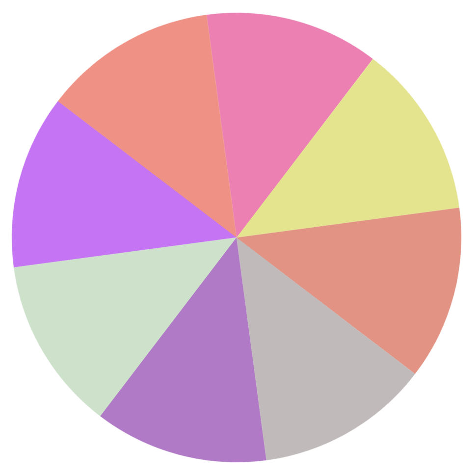

<h3 style="display:flex;justify-content:center;border: 4px dashed turquoise; padding: 4px;width:230px;">
    Arc Spinner
</h3>

    ⬇️⬇️⬇️Looks like this ⬇️⬇️⬇️

    

    <a style="text-decoration:underline;" href="https://lukec611.github.io/arc-spinner/">View Here</a>

